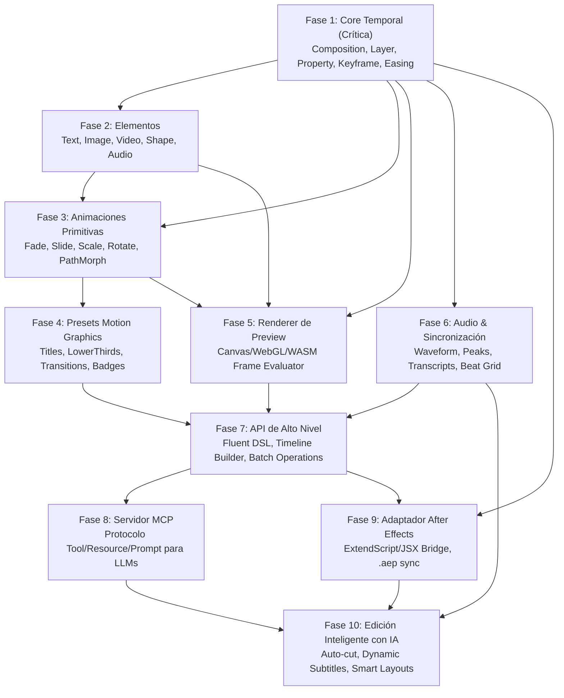

# Master Project Plan: Motion Graphics Engine & AE MCP

Este documento define la arquitectura general, dependencias de fases y contratos de interfaz para las 10 fases del proyecto.

---

## 1. Matriz de Fases y Dependencias

---

## 2. Definición y Alcance por Fase

| Fase | Objetivo | Entregables / Contrato | Dependencias |
|---|---|---|---|
| **1** | **Core Temporal** *(Crítica)* | Modelos de Composición, Capa, Propiedad, Keyframe, Espacio Temporal, Interpolación Bezier/Easing, Jerarquía de Transformaciones y Evaluador determinista. | Ninguna (Fundacional) |
| **2** | **Elementos** | Modelado formal de capas de Text (tipografía, alignment), Image (assets raster), Video (fps/clip in-out), Shape (paths vectoriales, boolean ops, stroke/fill), Audio. | Fase 1 |
| **3** | **Animaciones Primitivas** | Abstracción de animaciones atómicas reutilizables (`fadeIn`, `slideIn`, `popScale`, `pathWiggle`, `stagger`) mapeadas a keyframes del Core. | Fases 1, 2 |
| **4** | **Presets Motion Graphics** | Biblioteca de plantillas compuestas (Lower Thirds, Kinetic Typography, Callouts, Kinetic Transitions) con slots de parámetros editables. | Fases 1, 2, 3 |
| **5** | **Renderer de Preview** | Motor de rasterización/evaluación instantánea de frames (Node.js/Skia/Canvas o WebGL) para validar el estado del timeline sin abrir AE. | Fases 1, 2, 3 |
| **6** | **Audio, Beats & Sync** | Extracción de espectrograma/transitorios, BPM tracking, grid de beats, ingesta de transcripciones (Whisper timestamps) y alineación temporal. | Fase 1 |
| **7** | **API de Alto Nivel** | DSL declarativo / fluido para construir secuencias complejas en pocas líneas (`comp.addText(...).animate(...)`). | Fases 1 a 6 |
| **8** | **Capa MCP (Model Context Protocol)** | Exposición del modelo y herramientas mediante el protocolo MCP para agentes IA autónomos y asistentes. | Fase 7 |
| **9** | **Adaptador After Effects** | Serializador y deserializador bidireccional entre el Core y el DOM de After Effects (JSX/ExtendScript / `.aep` / `.jsx`). | Fases 1, 7 |
| **10** | **Edición Inteligente IA** | Orquestador de agentes de IA para creación y edición asistida: auto-layout, subtitulado dinámico estilo karaoke, auto-highlights al ritmo musical. | Fases 6, 8, 9 |

---

## 3. Principios Arquitectónicos de los Contratos

1. **Agnosticismo del Motor de Render:** El Core Temporal (Fase 1) y los Elementos (Fase 2) son representaciones intermedias (**IR - Intermediate Representation**) puras. No dependen del DOM de After Effects ni del navegador; pueden compilarse a After Effects, Remotion, WebGL, Canvas o FFmpeg.
2. **Determinismo Temporal Absoluto:** Todo estado visual en el instante $t$ es una función pura:
   $$\text{FrameState}(t) = \text{Evaluate}(\text{Composition}, t)$$
3. **Inmutabilidad y Serializabilidad:** Todo el estado del proyecto debe ser 100% serializable a JSON validado por esquemas tipados (Zod / TypeScript).
4. **Precisión Sub-frame:** Todo cálculo temporal soporta números racionales/punto flotante de 64 bits para evitar desincronización acumulativa entre audio y video.
