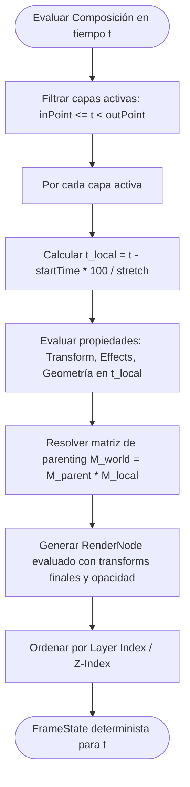

# Contrato Técnico: Fase 1 - Core Temporal

**Estado:** ESPECIFICACIÓN FORMAL  
**Versión:** 1.0.0  
**Área:** Motor de Animación y Línea de Tiempo (Timeline Core)

---

## 1. Fundamentos Matemáticos y Representación del Tiempo

### 1.1. Dualidad Temporal: Continuo vs Discreto

El sistema opera bajo una estricta dualidad temporal:
1. **Tiempo Continuo ($t \in \mathbb{R}$, segundos):** Base matemática para evaluación de interpolaciones, curvas Bezier, físicas y audio continuo.
2. **Tiempo Discreto ($f \in \mathbb{Z}$, frames):** Base de cuantización para renderizado, visualización en timeline y sincronización con After Effects.

### 1.2. Fórmulas de Conversión e Invariantes

Dado un framerate $\text{fps} = \frac{\text{fpsNumerator}}{\text{fpsDenominator}}$ (ej. $\frac{30000}{1001} \approx 29.97$):

$$\text{frameToSeconds}(f, \text{fps}) = \frac{f \cdot \text{fpsDenominator}}{\text{fpsNumerator}}$$

$$\text{secondsToFrame}(t, \text{fps}) = \operatorname{round}\left( t \cdot \frac{\text{fpsNumerator}}{\text{fpsDenominator}} \right)$$

$$\text{quantizeToFrameRate}(t, \text{fps}) = \text{frameToSeconds}(\text{secondsToFrame}(t, \text{fps}), \text{fps})$$

> [!IMPORTANT]
> Para evitar errores acumulativos de punto flotante en proyectos de larga duración (drift de audio/video), las tasas de cuadros como `23.976`, `29.97` y `59.94` se deben almacenar como números racionales exactos $(\text{num}, \text{den})$.

---

## 2. Transformaciones de Espacios Temporales

Existen 4 espacios temporales jerárquicos:

```
[ Master / Global Timeline Time (T_global) ]
                   │
                   ▼ (Offset de Composición en Master)
       [ Composition Time (t_comp) ]
                   │
                   ▼ (startTime, stretch, inPoint)
          [ Layer Local Time (t_layer) ]
                   │
                   ▼ (Time Remapping / Speed Graph)
         [ Source Media Time (t_source) ]
```

### 2.1. Ecuación de Transformación de Capa

Sea una capa con:
- $\text{startTime} \in \mathbb{R}$: Instante en la composición donde se ubica el origen local de la capa ($t_{\text{layer}} = 0$).
- $\text{stretch} \in \mathbb{R} \setminus \{0\}$: Factor de estiramiento temporal en porcentaje (100% = normal, 200% = doble duración/cámara lenta, -100% = reversa).
- $\text{inPoint}, \text{outPoint} \in \mathbb{R}$: Rango de visibilidad/actividad de la capa en tiempo de composición.

El tiempo local de la capa $t_{\text{layer}}$ para un instante $t_{\text{comp}}$ es:

$$t_{\text{layer}} = (t_{\text{comp}} - \text{startTime}) \cdot \left( \frac{100}{\text{stretch}} \right)$$

### 2.2. Invariante de Actividad y Visibilidad

$$\text{isLayerActive}(t_{\text{comp}}) \iff (\text{inPoint} \le t_{\text{comp}} < \text{outPoint}) \land \text{enabled}$$

Si una capa está inactiva en $t_{\text{comp}}$, el evaluador omite el cálculo de sus propiedades de renderizado.

### 2.3. Precomposiciones y Time Remapping

Cuando una capa es una precomposición o clip con Time Remapping activo:
$$t_{\text{source}} = \text{EvaluateProperty}(\text{Layer.timeRemap}, t_{\text{layer}})$$

Si no hay Time Remapping:
$$t_{\text{source}} = t_{\text{layer}}$$

---

## 3. Modelo de Propiedades y Keyframing

Toda propiedad visual o de audio es de tipo `Property<T>`, pudiendo ser **Estática** (valor constante) o **Animada** (gobernada por keyframes y/o expresiones).

### 3.1. Tipos de Datos de Propiedad

| Tipo de Propiedad | Representación | Ejemplo |
|---|---|---|
| `Scalar` | `number` | Opacidad (0-100), Radio (px), Rotación (grados) |
| `Vector2D` | `[number, number]` | Posición 2D, Escala [x, y] % |
| `Vector3D` | `[number, number, number]` | Posición 3D, Orientación 3D |
| `Color` | `[number, number, number, number]` | RGBA normalizado $[0.0, 1.0]$ |
| `PathShape` | `{ vertices: Vector2D[], inTangents: Vector2D[], outTangents: Vector2D[], closed: boolean }` | Forma vectorial / Máscara |

---

### 3.2. Estructura de un Keyframe

Un keyframe $K_i$ se define como:
$$K_i = (t_i, v_i, \text{interpIn}_i, \text{interpOut}_i, \text{temporalEaseIn}_i, \text{temporalEaseOut}_i, \text{spatialTangentIn}_i, \text{spatialTangentOut}_i)$$

Donde:
- $t_i$: Tiempo del keyframe en segundos (o frames exactos).
- $v_i$: Valor de la propiedad en $t_i$.
- `interpOut`: Tipo de interpolación hacia el siguiente keyframe (`HOLD`, `LINEAR`, `BEZIER`).
- `interpIn`: Tipo de interpolación entrante desde el keyframe anterior.

---

## 4. Curvas de Easing e Interpolación Temporal

Para cualquier tiempo $t$ comprendido entre dos keyframes adyacentes $K_1 (t_1, v_1)$ y $K_2 (t_2, v_2)$:

$$\Delta t = t_2 - t_1, \quad \Delta v = v_2 - v_1, \quad s = \frac{t - t_1}{\Delta t} \in [0, 1]$$

### 4.1. Modos de Interpolación

1. **HOLD:**
   $$v(t) = v_1 \quad \forall t \in [t_1, t_2)$$
2. **LINEAR:**
   $$v(t) = v_1 + s \cdot (v_2 - v_1)$$
3. **BEZIER (Cubic Easing):**
   La velocidad e influencia de salida de $K_1$ y de entrada de $K_2$ definen una curva Bezier cúbica 1D normalizada:
   $$B(u) = (1-u)^3 P_0 + 3(1-u)^2 u P_1 + 3(1-u) u^2 P_2 + u^3 P_3$$
   donde $P_0 = (0, 0)$ y $P_3 = (1, 1)$.

   Los puntos de control $P_1 = (x_1, y_1)$ y $P_2 = (x_2, y_2)$ se calculan a partir del `speed` y el `influence` (0 a 100%):
   $$x_1 = \frac{\text{influenceOut}_1}{100}, \quad y_1 = \frac{\text{speedOut}_1 \cdot \Delta t}{\Delta v} \cdot x_1$$
   $$x_2 = 1 - \frac{\text{influenceIn}_2}{100}, \quad y_2 = 1 - \frac{\text{speedIn}_2 \cdot \Delta t}{\Delta v} \cdot (1 - x_2)$$

   Para evaluar en $s \in [0, 1]$, se resuelve $u$ tal que $B_x(u) = s$ (vía Newton-Raphson) y luego:
   $$v(t) = v_1 + B_y(u) \cdot \Delta v$$

---

## 5. Jerarquía Espacial (Parenting & Transform Matrix)

Cada capa posee una propiedad `Transform` que incluye:
- $\text{AnchorPoint} \in \mathbb{R}^2$ o $\mathbb{R}^3$
- $\text{Position} \in \mathbb{R}^2$ o $\mathbb{R}^3$
- $\text{Scale} \in \mathbb{R}^2$ o $\mathbb{R}^3$ (en porcentaje, base 100%)
- $\text{Rotation} \in \mathbb{R}$ (o $\text{Orientation} \in \mathbb{R}^3$)
- $\text{Opacity} \in [0, 100]$

### 5.1. Matriz Local $M_{\text{local}}(t)$ en 2D:

$$M_{\text{local}}(t) = T(\text{Position}(t)) \times R(\text{Rotation}(t)) \times S\left(\frac{\text{Scale}(t)}{100}\right) \times T(-\text{AnchorPoint}(t))$$

### 5.2. Herencia de Transformación Mundial ($M_{\text{world}}$):

Si la capa tiene un padre ($\text{parentId}$):
$$M_{\text{world}}(t) = M_{\text{world\_parent}}(t) \times M_{\text{local}}(t)$$
$$\text{Opacity}_{\text{world}}(t) = \text{Opacity}_{\text{parent\_world}}(t) \cdot \frac{\text{Opacity}_{\text{local}}(t)}{100}$$

Si la capa no tiene padre:
$$M_{\text{world}}(t) = M_{\text{local}}(t)$$

---

## 6. Algoritmo del Evaluador Determinista (Timeline Evaluator)



---

## 7. Invariantes del Contrato

1. **Monotonía Temporal de Keyframes:**
   $$\forall i < j, \quad t(K_i) < t(K_j)$$
   Dos keyframes en la misma propiedad no pueden compartir el mismo instante $t$.
2. **Determinismo:**
   Dado un árbol de composición inmutable $C$ y un tiempo $t \in \mathbb{R}$, $\text{Evaluate}(C, t)$ produce exactamente el mismo `FrameState` binario/numérico en cualquier ejecución.
3. **No-Ciclicidad en Parenting:**
   El grafo de padres de capas debe ser un **Árbol / DAG** acíclico estricto. Una capa nunca puede ser su propio ancestro.
