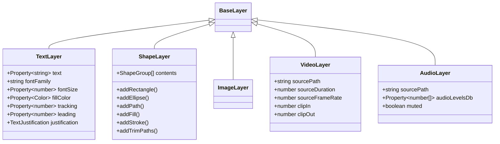

# Contratos de Interfaz: Fases 2 a 10

Este documento define las especificaciones técnicas y contratos de entrada/salida para las fases subsiguientes del motor.

---

## Fase 2: Elementos (Text, Image, Video, Shape, Audio)

Define el modelo de datos de contenido que reside dentro de `BaseLayer.data`.



---

## Fase 3: Animaciones Primitivas

Abstracción composable de alto nivel para aplicar keyframes atómicos sin calcular manualmente tangentes Bezier:

- `fadeIn(duration, ease)` / `fadeOut(duration, ease)`
- `slideIn(direction: 'left'|'right'|'top'|'bottom', distance, duration, ease)`
- `popScale(fromScale, toScale, overshoot, duration)`
- `pathWiggle(amplitude, frequency)`
- `stagger(elements, interval, animationFn)`

**Contrato:** Una primitiva recibe `(layer, startTime, options)` y genera keyframes conformes al contrato de la Fase 1.

---

## Fase 4: Presets de Motion Graphics

Plantillas reutilizables parametrizadas:
- **Kinetic Titles & Headlines**
- **Lower Thirds (con auto-resize de cajas de fondo según longitud del texto)**
- **Logo Reveals & Badges**
- **Transiciones de Escena (Wipe, Zoom, Glitch, Morph)**

**Contrato de Preset:**
```typescript
export interface MotionPreset<TParams = Record<string, any>> {
  id: string;
  name: string;
  category: string;
  defaultDuration: number;
  parametersSchema: z.ZodType<TParams>;
  build: (comp: Composition, startTime: number, params: TParams) => BaseLayer[];
}
```

---

## Fase 5: Renderer de Preview

Motor determinista ligero para evaluar y renderizar frames a imágenes PNG/JPEG/Canvas sin necesidad de abrir After Effects:
- **Input:** `Composition`, `time` (segundos).
- **Process:** `Evaluator.evaluateFrame(comp, time)` $\rightarrow$ Rasteriza capas activas por orden de capas con operaciones de matriz 2D/3D y blend modes.
- **Output:** `Buffer` (PNG) o `ImageData` para inspección visual inmediata en MCP o UI web.

---

## Fase 6: Audio, Beats, Transcript y Sincronización

Módulo de análisis y orquestación rítmica:
1. **Analizador de Onda (Waveform/FFT):** Detección de transitorios y espectrograma de archivos WAV/MP3.
2. **Beat Grid:** Cálculo de BPM y generación de marcadores en tiempos $t = k \cdot \frac{60}{\text{BPM}}$.
3. **Transcripción (Whisper JSON):** Ingesta de palabras con timestamps exactos (`start`, `end`, `word`) para subtitulado dinámico sincronizado.

---

## Fase 7: API de Alto Nivel (Builder DSL)

API fluida orientada a desarrolladores y LLMs:

```typescript
const comp = new TimelineBuilder({ width: 1920, height: 1080, fps: 30, duration: 10 })
  .addAudio("voiceover.wav")
  .addText("¡Bienvenido al futuro!", { fontSize: 80, color: [1, 1, 1, 1] })
    .at(0.5)
    .fadeIn(0.4)
    .popScale(80, 100, 0.5)
    .slideOut('left', 2.0);
```

---

## Fase 8: Capa de Integración MCP (Model Context Protocol)

Exposición estandarizada para Agentes de IA:
- **Tools:** Creación de composiciones, consulta de estado de frame, aplicación de presets, análisis de audio, generación de subtítulos sincronizados.
- **Resources:** Estado completo del proyecto (`timeline://composition/active`), previews de frames (`preview://composition/frame?t=2.5`).
- **Prompts:** Plantillas de tareas de edición, generación de videos cortos (Shorts/Reels) y animación de textos.

---

## Fase 9: Adaptador After Effects (Compiler / Transpiler)

Compilador bidireccional entre la representación intermedia (IR) y el DOM de After Effects:
- `compileToExtendScript(comp: Composition): string` (Genera código `.jsx` reproducible que crea exactamente la composición en After Effects con capas, efectos, curvas Bezier y keyframes nativos).
- `importFromAfterEffects(projectData): Composition` (Convierte proyectos de AE en el formato IR).

---

## Fase 10: Edición Inteligente mediante IA

Orquestador de alto nivel con agentes especializados:
1. **Auto-Cutter:** Recorte inteligente de silencios y tomas falsas a partir del audio.
2. **Kinetic Subtitle Generator:** Subtítulos animados palabra por palabra con resaltado de color y efectos pop según el énfasis vocal.
3. **Smart Layout Engine:** Ajuste automático de relaciones de aspecto (16:9 $\leftrightarrow$ 9:16) con reencuadre inteligente y reposicionamiento de elementos gráficos.
