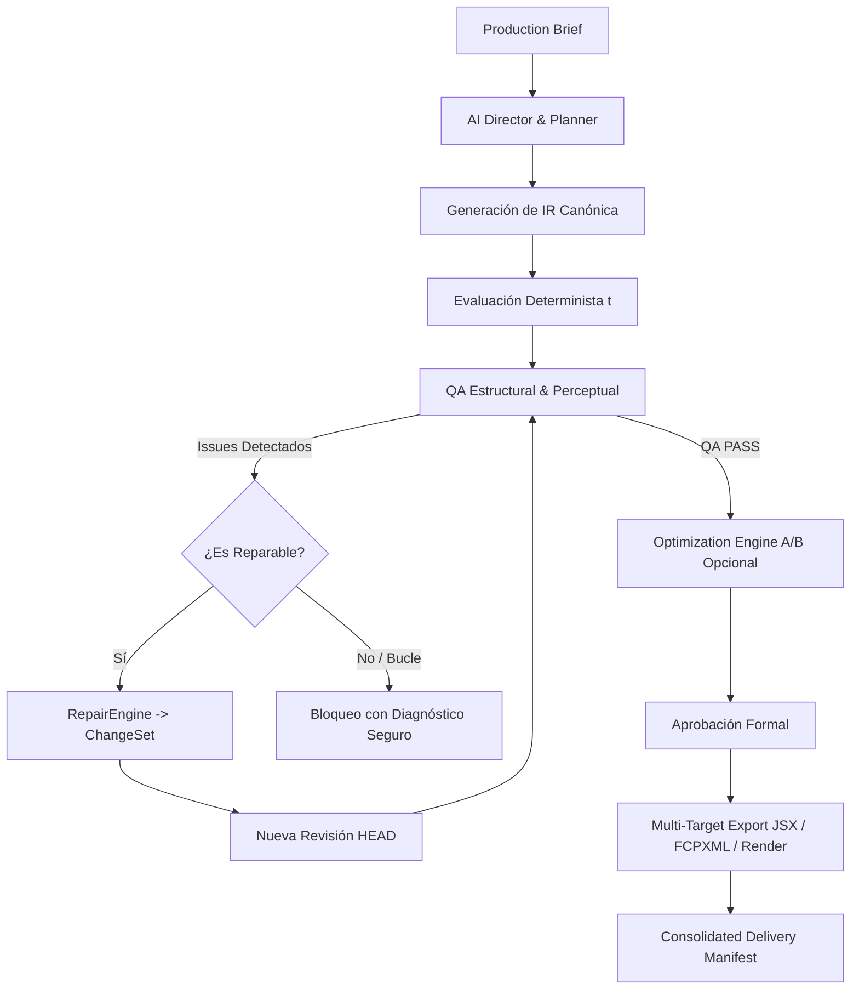

# 🤖 Manual Operativo Maestro para Agentes IA
## Plataforma de Producción Audiovisual Autónoma y Determinista (Milestone 23 / v2.3.0)

Este documento es la **guía integral y exhaustiva** diseñada para que cualquier modelo de lenguaje o agente autónomo (IA) comprenda, opere, extienda y controle toda la arquitectura audiovisual construida en el repositorio.

---

## 📑 Tabla de Contenidos
1. [Principios e Invariantes Arquitectónicos](#1-principios-e-invariantes-arquitectónicos)
2. [Arquitectura del Sistema en 3 Niveles](#2-arquitectura-del-sistema-en-3-niveles)
3. [El Ciclo de Vida de Producción de Extremo a Extremo](#3-el-ciclo-de-vida-de-producción-de-extremo-a-extremo)
4. [Guía Rápida de Módulos y APIs del Core](#4-guía-rápida-de-módulos-y-apis-del-core)
5. [Control Plane MCP: Herramientas y Recursos Declarativos](#5-control-plane-mcp-herramientas-y-recursos-declarativos)
6. [Recetario Práctico para Agentes (Code Recipes)](#6-recetario-práctico-para-agentes-code-recipes)
7. [Manejo de Errores y Reglas Críticas de Seguridad](#7-manejo-de-errores-y-reglas-críticas-de-seguridad)

---

## 1. Principios e Invariantes Arquitectónicos

Cualquier agente IA que opere este sistema **DEBE obedecer estrictamente los siguientes invariantes**:

1. **La IR Canónica es la ÚNICA Fuente de Verdad:**
   - Nunca intentes mantener un segundo timeline o un estado paralelo en memoria.
   - Todo renderizado, exportación o análisis perceptual se calcula a partir de la IR canónica evaluada en el tiempo: $\text{Evaluate}(\text{IR}, t) \implies \text{FrameState}(t)$.
2. **Inmutabilidad y No Mutación Lateral:**
   - **PROHIBIDO:** `project.compositions[0].layers.push(...)` o modificar objetos in-place.
   - **CORRECTO:** Cualquier mutación debe realizarse como una transacción declarativa:
     $$\text{IR} \xrightarrow{\text{ChangeSet}} \text{Validation} \xrightarrow{\text{RevisionEngine}} \text{Nueva Revisión } (\text{HEAD})$$
3. **Determinismo Criptográfico Absoluto:**
   - Prohibido el uso de `Math.random()`, `Date.now()`, `crypto.randomUUID()` o variables dependientes del hardware para generar identidades, rankings, scores o hashes canónicos.
   - Mismo input + misma configuración + misma seed = **idéntico resultado byte-por-byte**.
4. **Prioridad Absoluta de QA sobre Scores:**
   - Un score de calidad o creatividad alto (ej. 98/100) **NUNCA puede autorizar una entrega** si existen errores bloqueantes (`fatal` o `error`). Si hay un fallo bloqueante, el estado resultante es `FAIL` / `BLOCKED`.
5. **Reversibilidad Matemática de Parches:**
   - Todo cambio aplicado genera un delta $\Delta$ estrictamente reversible:
     $$\text{reversePatch}(\text{applyPatch}(P, \Delta), \Delta) \equiv P$$

---

## 2. Arquitectura del Sistema en 3 Niveles

```
┌─────────────────────────────────────────────────────────────────────────┐
│                       NIVEL 1 — DECLARATIVO (IR)                        │
│   • Compositions, Video/Audio Tracks, Clips, Transitions, Keyframes     │
│   • Typography Shaper, Subtitles/Captions, Effects Stack, SafeZones     │
└────────────────────────────────────┬────────────────────────────────────┘
                                     │
┌────────────────────────────────────▼────────────────────────────────────┐
│                       NIVEL 2 — EVALUACIÓN (t)                          │
│   • Composition.evaluate(t) -> FrameState & AudioMixer                  │
│   • Transform Resolver (Affine 2D pure math, Anchor points normalizados)│
│   • Kinetic Motion Trees & Spring Physics                               │
└────────────────────────────────────┬────────────────────────────────────┘
                                     │
┌────────────────────────────────────▼────────────────────────────────────┐
│                    NIVEL 3 — PERCEPCIÓN, QA Y EXPORT                    │
│   • QA Multi-Capa (7 Familias) & Perceptual QA (Contraste, Colisiones)  │
│   • Exporters: After Effects JSX ExtendScript, FCPXML, EDL, MP4         │
│   • Persistencia CAS, Optimización A/B, Revision DAG & Workflows        │
└─────────────────────────────────────────────────────────────────────────┘
```

---

## 3. El Ciclo de Vida de Producción de Extremo a Extremo

Cuando recibas un encargo creativo (brief) para producir un video, sigue este flujo estándar:



---

## 4. Guía Rápida de Módulos y APIs del Core

### 4.1 Composición y Timeline (`src/core/`, `src/timeline/`)
- `Composition`: Contenedor principal con `width`, `height`, `fps`, `duration`.
- `evaluate(time: Time)`: Evalúa determinísticamente el estado de todas las capas en el segundo $t$.
- `Timeline`: Estructura NLE con pistas de video y audio (`Track`), clips recortados (`inPoint`, `outPoint`, `start`) y transiciones (`Cut`, `Crossfade`, `Zoom`, `Slide`).

### 4.2 Transformaciones y Geometría 2D (`src/transform/`)
- `Matrix2D`: Transformaciones afines puras (traslación, escala, rotación en grados, anclaje normalizado $(0..1, 0..1)$).
- `TransformResolver`: Resuelve la matriz absoluta y opacidad compuesta a lo largo del árbol jerárquico (`parent -> child`) con detección estricta de ciclos (`HierarchyCycleError`).

### 4.3 Subtítulos y Tipografía Cinética (`src/captions/`, `src/typography/`)
- `CaptionEngine`: Genera subtítulos palabra por palabra sincronizados con audio.
- `SafeZoneResolver`: Garantiza que el texto respete los márgenes de seguridad de TikTok (9:16), Reels o YouTube Shorts.
- `TextShaper`: Procesa ligaduras tipográficas, clusters Unicode y emojis sin corromper el layout.

### 4.4 Persistencia, Revisiones y Workflows (`src/persistence/`, `src/revisions/`, `src/workflows/`)
- `FileProjectStore`: Guarda proyectos en disco con escrituras atómicas `.tmp` $\to$ `fsync` $\to$ `rename`.
- `RevisionGraph`: Grafo DAG con linaje completo de versiones, branching, merge 3-way y rollback no destructivo.
- `WorkflowEngine`: Ejecuta tareas ordenadas topológicamente con checkpoints automáticos tras cada paso.

### 4.5 QA y Aseguramiento Perceptual (`src/production/qa/`, `src/perceptual/`)
- `QAEngine`: Ejecuta las 7 familias de QA (Estructural, Timeline, Captions, Audio, Visual, Assets y Export).
- `PerceptualQAEngine`: Valida frames renderizados analizando ratios de contraste WCAG, colisiones espaciales (IoU), flashes fotosensibles y picos de audio.

---

## 5. Control Plane MCP: Herramientas y Recursos Declarativos

El servidor MCP (`src/mcp/server.ts`) expone todas las capacidades para que un agente las invoque mediante RPC tipado.

### 🛠️ Herramientas MCP Principales

| Categoría | Nombre de la Herramienta | Función para el Agente |
|---|---|---|
| **Proyectos** | `create_project` | Crea un nuevo proyecto con resolución, fps y metadatos. |
| **Proyectos** | `load_project` | Carga el snapshot canónico de un proyecto existente. |
| **Mutaciones** | `apply_project_mutation` | Aplica una mutación (`add_layer`, `update_transform`, `add_clip`) generando una nueva revisión. |
| **Revisiones** | `create_revision_branch` | Crea una rama (`branch`) en el grafo DAG de revisiones. |
| **Revisiones** | `compare_revisions` | Emite un diff semántico estructurado entre dos revisiones. |
| **Revisiones** | `merge_revision_branches` | Fusiona dos ramas mediante merge 3-way determinista. |
| **Workflows** | `execute_workflow` | Ejecuta un workflow DAG con checkpoints automáticos. |
| **Workflows** | `resume_workflow` | Reanuda un workflow interrumpido desde el último checkpoint válido. |
| **Producción** | `run_production_job` | Ejecuta el pipeline autónomo completo: $\text{Brief} \to \text{Plan} \to \text{IR} \to \text{QA} \to \text{Repair} \to \text{Delivery}$. |
| **Optimización**| `create_creative_experiment` | Configura un espacio de búsqueda A/B/Pareto sobre una revisión baseline. |
| **Optimización**| `run_creative_experiment` | Evalúa variantes deterministas y selecciona al ganador. |
| **Percepción** | `analyze_production_perception` | Ejecuta el análisis perceptual de contraste, colisiones, flashes y clipping. |
| **Exportación** | `export_project_jsx` | Compila el proyecto en script ExtendScript JSX para Adobe After Effects. |
| **Exportación** | `export_project_fcpxml` | Genera archivo FCPXML para Final Cut Pro / DaVinci Resolve. |
| **Exportación** | `export_project_edl` | Genera archivo CMX 3600 EDL estándar. |

### 📂 Recursos Declarativos MCP (`Resources`)
- `projects://list`: Listado de todos los proyectos persistidos.
- `projects://{id}/manifest`: Manifiesto y metadatos del proyecto.
- `projects://{id}/revisions`: Historial y linaje del grafo DAG de revisiones.
- `workflows://{id}/status`: Estado, checkpoints y progreso de un workflow.
- `production://{jobId}/qa`: Reporte detallado de QA del trabajo de producción.
- `experiment://{experimentId}/report`: Reporte con ranking y deltas del experimento creativo.

---

## 6. Recetario Práctico para Agentes (Code Recipes)

### 🍳 Receta 1: Creación de un Video con Subtítulos y Animación en TypeScript

```typescript
import { Composition } from "./core/Composition.js";
import { TextElement } from "./elements/TextElement.js";
import { KeyframeTrack } from "./animation/KeyframeTrack.js";
import { ProjectService } from "./project/ProjectService.js";
import { MemoryProjectStore } from "./persistence/MemoryProjectStore.js";

// 1. Inicializar servicio de proyectos
const store = new MemoryProjectStore();
const service = new ProjectService(store);

// 2. Crear proyecto en formato vertical (TikTok / 9:16)
const project = await service.createProject({
  name: "Short_Hook_Video",
  width: 1080,
  height: 1920,
  fps: 60,
  duration: 15.0,
});

// 3. Crear composición principal
const comp = new Composition({
  id: "comp_main",
  name: "Main Timeline",
  width: 1080,
  height: 1920,
  fps: 60,
  duration: 15.0,
});

// 4. Crear elemento de texto kinetic con anclaje al centro
const title = new TextElement({
  id: "txt_hook",
  text: "3 SECRETOS DE MOTION GRAPHICS",
  fontSize: 72,
  fontFamily: "Inter-Bold",
  color: "#FFFFFF",
  transform: {
    position: { x: 540, y: 960 },
    anchor: { x: 0.5, y: 0.5 },
    scale: { x: 1.0, y: 1.0 },
    rotation: 0,
    opacity: 1.0,
  },
});

comp.addElement(title);

// 5. Evaluar en el segundo t = 0.5
const snapshot = comp.evaluate(0.5);
console.log(`Elementos evaluados: ${snapshot.elements.length}`);
```

---

### 🍳 Receta 2: Mutación Declarativa Segura con ChangeSet y Rollback

```typescript
import { RevisionManager } from "./revisions/RevisionManager.js";
import { ChangeSet } from "./production/ChangeSet.js";

// Toda modificación debe ser declarativa
const changeSet: ChangeSet = {
  changeSetId: "cs_highlight_color",
  description: "Ajustar color de highlight y escala de entrada",
  operations: [
    {
      type: "set-property",
      targetId: "txt_hook",
      property: "color",
      value: "#FFFF00", // Amarillo de alto contraste
    },
    {
      type: "set-property",
      targetId: "txt_hook",
      property: "transform.scale",
      value: { x: 1.15, y: 1.15 },
    },
  ],
};

// Aplicar a través del RevisionManager produciendo una nueva revisión inmutable
const newRevision = await revisionManager.commitChangeSet(currentRevisionId, changeSet);
console.log(`Nueva revisión creada: ${newRevision.revisionId}`);
```

---

### 🍳 Receta 3: Exportación a Script JSX para Adobe After Effects

```typescript
import { AeJsxCompiler } from "./exporters/AeJsxCompiler.js";
import { Composition } from "./core/Composition.js";

const compiler = new AeJsxCompiler();
const jsxScript = compiler.compile(composition);

// El script resultante puede ejecutarse directamente en After Effects vía ExtendScript:
// app.project.items.addComp("Main Timeline", 1080, 1920, 1.0, 15.0, 60);
console.log(jsxScript);
```

---

## 7. Manejo de Errores y Reglas Críticas de Seguridad

### 🛡️ Jerarquía de Errores Tipados
Todos los errores del sistema heredan de clases base especializadas y contienen contexto estructurado:
- `ValidationError`: Error en bounds, esquemas Zod o parámetros fuera de rango.
- `HierarchyCycleError`: Detección de ciclos de anidamiento (`A -> B -> A`).
- `RevisionConflictError`: Conflicto de concurrencia optimista al intentar commitear sobre un HEAD desactualizado.
- `RevisionLoopDetectedError`: El motor de reparación detectó un bucle repetitivo de correcciones sin convergencia.
- `PathSecurityError`: Intento de acceder a una ruta fuera del directorio seguro (prevención de Path Traversal).

### 🚫 Prohibiciones Absolutas para la IA:
1. **Nunca modifiques tests para forzar que pasen:** Si un test falla, la causa es una violación al contrato formal. Corrige la lógica del módulo, no la prueba.
2. **Nunca escribas archivos sin sanitizar la ruta:** Utiliza siempre `PathSanitizer.sanitize(path, baseDir)`.
3. **Nunca ignores diagnósticos de QA:** Si `QAReport.status === "fail"`, debes emitir una estrategia de reparación válida o detener el pipeline informando el motivo exacto.
4. **Nunca generes diseños planos o con fuentes serif por defecto:** Consulta y obedece siempre [`docs/USER_DESIGN_PREFERENCES.md`](file:///F:/Dev/after-effects-mcp/docs/USER_DESIGN_PREFERENCES.md).

---

## 8. Estándares Visuales y Preferencias de Diseño del Usuario

Para garantizar que el resultado visual generado en scripts de After Effects cumpla con los estándares de agencia del usuario:

1. **Guía Maestra:** Leer [`docs/USER_DESIGN_PREFERENCES.md`](file:///F:/Dev/after-effects-mcp/docs/USER_DESIGN_PREFERENCES.md).
2. **Estilo Principal Aprobado:** **Editorial Poster / TIME Style** (Tipografía gigante condensada en rojo `#FF1424` y blanco, interletraje negativo, animación palabra por palabra y diales vectoriales).
3. **Estilo Secundario:** **Minimal Luxury / Tech** (Apple/Linear dark aesthetic).
4. **Invariantes Visuales:** Siempre habilitar `comp.motionBlur = true`, `ParagraphJustification.CENTER_JUSTIFY` y viñeteado de contraste sobre videos reales.

---

## 9. Bitácora Obligatoria de Mejoras Post-Fase

Toda mejora, optimización, parche o módulo nuevo agregado al motor **fuera del ciclo de una fase formal** debe registrarse obligatoriamente en [`docs/POST_PHASE_IMPROVEMENTS.md`](file:///F:/Dev/after-effects-mcp/docs/POST_PHASE_IMPROVEMENTS.md) documentando:
- **Fecha y Versión:** Momento exacto de incorporación.
- **Módulos Afectados:** Rutas en `src/`.
- **¿Por qué se agregó? (Causa raíz / Problema detectado):** Qué limitación o bug motivó la mejora.
- **¿Para qué se agregó? (Solución / Beneficio técnico):** Qué hace y cómo previene fallos futuros.
- **Archivos Creados / Modificados.**
- **Pruebas y Verificación:** Resultados de la suite de pruebas automatizadas.

*Nota:* Si el usuario solicita una **fase nueva**, se continúa el flujo formal documentando `spec/phase-X.md` y `docs/phases/phase-X-report.md`.

---

## 10. Operación con los 15 Presets de Creadores y Declarative Production DSL

Para producir videos profesionales en 1 solo paso con menos de 100 tokens, la IA debe utilizar el compilador declarativo `ProductionDSLCompiler`:

```typescript
import { ProductionDSLCompiler } from "./src/dsl/ProductionDSL.js";
import { StyleProfileManager } from "./src/styles/StyleProfileManager.js";

// Compilación declarativa en 1 paso
const compiled = ProductionDSLCompiler.compile({
  video: {
    format: "16:9", // "16:9" | "9:16" | "1:1"
    durationSec: 45.0,
    projectName: "DocumentaryInvestigation",
  },
  style: {
    preset: "johnny_harris_investigative", // Selecciona cualquiera de los 15 presets
    title: "THE HIDDEN WAR FOR THE OCEANS",
  },
  editing: {
    pacing: "balanced",
    beatSync: true,
    speedRamping: false,
    depthSandwich: true,
  },
  captions: {
    enabled: true,
    text: "IN 1982 THE TREATY WAS SIGNED",
  },
  soundDesign: {
    enabled: true,
    autoDucking: true,
  },
});

console.log(compiled.appliedProfile);
// -> "The Investigative Cartographer (Johnny Harris / Vox)"
```

### Tabla de Selección Rápida de Presets para Agentes IA:
1. `johnny_harris_investigative`: Mapas 3D, rutas punteadas, resaltador analógico Multiply.
2. `magnates_business_noir`: 3D Photo Parallax Cutouts, destello dorado `CC Light Sweep`, titulares `Cinzel`.
3. `veritasium_scientific_blueprint`: Cuadrículas milimétricas, cotas vectoriales y fórmulas matemáticas.
4. `lemmino_minimalist_cipher`: Coordenadas GPS militares, escaneo láser vertical y misterio.
5. `ali_abdaal_productivity`: Tarjetas flotantes Notion, texturas de papel y física de resorte.
6. `iman_gadzhi_agency_luxury`: Marcos 16mm/35mm con grano, alta moda y titulares `Bodoni MT`.
7. `mrbeast_hyper_retention`: Títulos 3D gigantes con borde 14px y flechas con rebote sinusoidal.
8. `hormozi_cashflow_captions`: Cajas split-box, resaltado verde/amarillo y punch zooms súbitos.
9. `true_crime_evidence_room`: Pizarra de corcho con fotos Polaroid, hilos rojos y sellos `CLASSIFIED`.
10. `cinematic_flow_vlog`: Transiciones orgánicas Sky Mask, Teal & Orange y títulos en el horizonte.
11. `saas_tech_showcase`: Glassmorphism, ondas expansivas de clic de ratón y degradados Stripe.
12. `wall_street_finance`: Velas japonesas alcistas/bajistas animadas y tickers bursátiles.
13. `sports_energy_fitness`: Cronómetros deportivos de milisegundos (`MM:SS.ms`) y tipografía `Teko`.
14. `retro_synthwave_arcade`: Suelo 3D de neón en perspectiva y sol retro animado 80s.
15. `time_editorial_poster`: Estilo insignia maestro TIME Magazine con Impact al $140\%$ y marco carmesí `#FF1424`.
