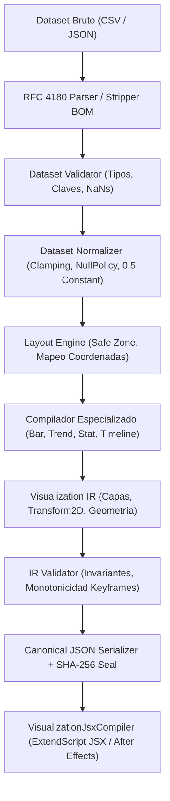

# Data Visualization Engine & Procedural Infographic Compiler (REQ-025)

## 📌 Visión General

El **Data Visualization Engine** (REQ-025) es el subsistema declarativo, no destructivo y determinista del motor **v4.0.0-editorial-master**, encargado de compilar datasets tabulares y estructurados (CSV, JSON o estructuras TypeScript) en representaciones intermedias (`VisualizationIR`), garantizando un sellado criptográfico determinista (SHA-256) y permitiendo la transpilación directa a scripts ejecutables de Adobe After Effects (`ExtendScript JSX`).

---

## 🏗️ Arquitectura del Pipeline

El flujo de procesamiento sigue una arquitectura unidireccional y desacoplada del software de destino:



---

## 📊 Familias de Visualización Implementadas

| Familia | Compilador / Generador | Características Principales |
| :--- | :--- | :--- |
| **Animated Bar Chart** | `compileAnimatedBarChart` | Orientaciones horizontal y vertical, ordenamiento (`ASCENDING`, `DESCENDING`, `SOURCE`), truncado `maxBars`, animación de crecimiento de barras y contadores numéricos sincronizados con *stagger*. |
| **Trend Line Graph** | `compileTrendLineGraph` | Soporte para fechas (ISO/timestamp) y valores numéricos continuos, interpolación lineal o spline cúbica suave acotada, animación *write-on* progresiva mediante `trimPath`, resaltado de extremos (máx/mín) con color de acento y cuadrícula (*grid*). |
| **Big Stat Card** | `generateBigStatCard` | Jerarquía visual editorial: valor gigante en tipografía ultra-bold condensada, etiqueta en mayúsculas con interletraje negativo, línea de acento y texto explicativo secundario. No requiere dataset tabular previo. |
| **Chronology Timeline** | `generateChronologyTimeline` | Distribución temporal no lineal basada en fechas reales, eje principal continuo, resolución de colisiones y asignación determinista de carriles (*lanes*) alternados, conectores vectoriales y nodos de hitos. |

---

## 🔒 Invariantes y Determinismo Criptográfico

1. **Determinismo Idéntico Byte a Byte:**
   $$\text{same dataset} + \text{same spec} + \text{same profile} \implies \text{byte-identical output}$$
   Prohibido terminantemente el uso de `Math.random()`, marcas de tiempo dinámicas (`Date.now()`) o identificadores UUID no derivativos en el IR o capas. Todos los IDs se generan mediante SHA-256 de sus propiedades intrínsecas (`generateDeterministicId`).

2. **Normalización Matemática Acotada:**
   $$n = \frac{v - v_{\min}}{v_{\max} - v_{\min}}, \quad \text{con } n = 0.5 \text{ cuando } v_{\max} = v_{\min}$$
   Todo valor normalizado reside estrictamente en $[0.0, 1.0]$.

3. **Inversión de Coordenadas de Pantalla:**
   $$\text{screenY} = \text{plotBottom} - (n \times \text{plotHeight})$$

4. **Respeto a Safe Zones:**
   Ningún elemento de datos puede renderizarse fuera de la zona segura declarada (`PERCENT` o `PX`), garantizando legibilidad en todos los formatos (16:9, 9:16, 1:1).

---

## 💻 Uso en CLI y MCP

### CLI:
```bash
# Compilar un dataset con especificación y generar ExtendScript JSX
node bin/editorial-cli.js data-viz --spec=fixtures/data-visualization/investigative-economy.json --jsx
```

### Herramientas MCP:
- `editorial_compile_data_visualization`: Compila dataset y spec en `VisualizationIR` sellado con SHA-256.
- `editorial_dataviz_to_jsx`: Transpila un `VisualizationIR` a un script ExtendScript JSX compatible con AE.
- `editorial_parse_dataset`: Valida y parsea datasets CSV (RFC 4180) o JSON tabulares.
- `editorial_validate_dataset`: Ejecuta validación estricta de esquema y tipos de columnas.
