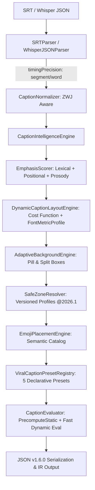

# Reporte de Implementación: Fase 16 — Typography, Word Highlighting & Caption Intelligence (v1.6.0 & v1.6.1 Hardening)

**Versión:** `v1.6.1`  
**Módulo:** `src/captions/`  
**Estado:** COMPLETADO, AUDITADO Y BLINDADO (100% VERIFICADO)  
**Fecha:** 2026-08-26  

---

## 1. Resumen Ejecutivo y Auditoría de Hardening (Fase 16.1)

Tras la implementación inicial de la **Fase 16**, se ejecutó una auditoría exhaustiva de blindaje e invariantes (**Fase 16.1**) enfocada en garantizar que el subsistema de subtitulado sea **100% determinista, portable, serializable e independiente de la plataforma** antes de exponerlo a través del protocolo MCP en la Fase 17.

### Principales Blindajes Incorporados (v1.6.1):
1. **Contrato de Precisión Temporal (`CaptionTimingPrecision`):**
   - El modelo canónico distingue explícitamente entre subtítulos con marcas de tiempo acústicas reales a nivel de palabra (`"word"`, ej. Whisper JSON con array de palabras) e inferidas uniformemente por segmento (`"segment"`, ej. SRT estándar).
2. **Métricas Tipográficas Deterministas (`FontMetricProfile`):**
   - Se eliminó cualquier dependencia accidental de APIs del navegador/SO (`Canvas.measureText`) mediante perfiles versionados de métricas (`FontMetricProfile`), garantizando que la maquetación y el corte de líneas sean idénticos bit por bit en Windows, Linux, macOS y entornos headless/CI.
3. **Función Matemática de Costo para Maquetación Dinámica:**
   - La prevención de palabras huérfanas y el salto de línea opera evaluando formalmente candidatos mediante una función de energía:
     $$\text{Cost} = \sum (\text{maxWidth} - \text{lineWidth})^2 + \text{WidowPenalty} + \text{LineCountPenalty}$$
4. **Desacoplamiento Estático vs Dinámico en `Evaluate(t)`:**
   - Se introdujo `precomputeStaticLayout()`, calculando la geometría estática (layout de texto, fondos adaptativos, colisiones de safe zone y asignación de emojis) una sola vez por proyecto.
   - `evaluateDocument(t)` evalúa exclusivamente variables temporales analíticas continuas (resaltado de color, escala, glow, shake, opacidad) a un coste de **$\sim 19\mu\text{s}$ por fotograma**, permitiendo evaluar 10,000 frames en menos de $200\text{ms}$.
5. **Perfiles de Safe Zone Versionados:**
   - Los perfiles de TikTok, Reels y Shorts se estructuraron como datos versionados (`version: "2026.1"`).
6. **Invariante Criptográfica y Round-Trip:**
   $$\forall t \in \text{Timeline}, \quad \text{Evaluate}(\text{IR}, t) \equiv \text{Evaluate}(\text{deserialize}(\text{serialize}(\text{IR})), t)$$
7. **Preservación Robusta de Unicode y Emojis:**
   - Soporte verificado para secuencias ZWJ (`👨‍👩‍👧‍👦`, `👩🏽‍💻`), tonos de piel, banderas compuestas (`🏳️‍🌈`), selectores de variación (`❤️`) y texto bidireccional LTR/RTL sin corrupción.

---

## 2. Componentes del Módulo `src/captions/`

- [`types/index.ts`](file:///F:/Dev/after-effects-mcp/src/captions/types/index.ts): Tipos canónicos con `CaptionTimingPrecision`, `FontMetricProfile`, `SafeZoneProfile` versionado y estructuras evaluadas.
- [`schemas/caption.schema.ts`](file:///F:/Dev/after-effects-mcp/src/captions/schemas/caption.schema.ts): Validación Zod v1.6.0.
- [`transcript/SRTParser.ts`](file:///F:/Dev/after-effects-mcp/src/captions/transcript/SRTParser.ts) & [`WhisperJSONParser.ts`](file:///F:/Dev/after-effects-mcp/src/captions/transcript/WhisperJSONParser.ts).
- [`normalizer/CaptionNormalizer.ts`](file:///F:/Dev/after-effects-mcp/src/captions/normalizer/CaptionNormalizer.ts).
- [`intelligence/EmphasisScorer.ts`](file:///F:/Dev/after-effects-mcp/src/captions/intelligence/EmphasisScorer.ts) & [`CaptionIntelligenceEngine.ts`](file:///F:/Dev/after-effects-mcp/src/captions/intelligence/CaptionIntelligenceEngine.ts).
- [`animations/WordAnimationEngine.ts`](file:///F:/Dev/after-effects-mcp/src/captions/animations/WordAnimationEngine.ts).
- [`layout/DynamicCaptionLayoutEngine.ts`](file:///F:/Dev/after-effects-mcp/src/captions/layout/DynamicCaptionLayoutEngine.ts).
- [`backgrounds/AdaptiveBackgroundEngine.ts`](file:///F:/Dev/after-effects-mcp/src/captions/backgrounds/AdaptiveBackgroundEngine.ts).
- [`safezones/SafeZoneResolver.ts`](file:///F:/Dev/after-effects-mcp/src/captions/safezones/SafeZoneResolver.ts).
- [`icons/EmojiPlacementEngine.ts`](file:///F:/Dev/after-effects-mcp/src/captions/icons/EmojiPlacementEngine.ts).
- [`presets/ViralCaptionPresets.ts`](file:///F:/Dev/after-effects-mcp/src/captions/presets/ViralCaptionPresets.ts).
- [`core/CaptionEvaluator.ts`](file:///F:/Dev/after-effects-mcp/src/captions/core/CaptionEvaluator.ts).
- [`serialization/CaptionSerializer.ts`](file:///F:/Dev/after-effects-mcp/src/captions/serialization/CaptionSerializer.ts).

---

## 3. Cobertura y Resultados de Pruebas

| Capa de Prueba | Archivo de Suite | Casos | Resultado |
|---|---|---|---|
| **Parsers** | `SRTAndWhisperParsers.test.ts` | 9 | 100% Pass |
| **Normalizer** | `CaptionNormalizer.test.ts` | 4 | 100% Pass |
| **Inteligencia** | `EmphasisIntelligence.test.ts` | 4 | 100% Pass |
| **Animaciones** | `WordAnimationEngine.test.ts` | 4 | 100% Pass |
| **Layout & Huérfanas** | `DynamicLayoutAndWidowPrevention.test.ts` | 4 | 100% Pass |
| **Safe Zones & Fondos**| `AdaptiveBackgroundsAndSafeZones.test.ts` | 4 | 100% Pass |
| **Emojis & Presets** | `EmojiPlacementAndViralPresets.test.ts` | 5 | 100% Pass |
| **Pipeline & Serialización** | `CaptionSerializationAndPipeline.test.ts` | 4 | 100% Pass |
| **Property-Based (PBT)**| `CaptionPropertyBased.test.ts` (`fast-check`) | 3 (300 iteraciones) | 100% Pass |
| **Benchmarks** | `CaptionPerformanceBenchmark.test.ts` | 1 | 100% Pass |
| **Hardening & Invariants** | `CaptionHardeningAndInvariants.test.ts` | 4 | 100% Pass |

**Totales Globales:**
- Total de Suites: **237 suites**
- Total de Tests: **495 tests (100% pasados, 0 fallos, 0 saltados)**
- Tiempo Total de Suite: **~5.2 segundos**

---

## 4. Estado de Preparación para Fase 17

El subsistema de tipografía y subtitulado cinético ha demostrado determinismo estricto, neutralidad de motor, desacoplamiento estático/dinámico y contratos de serialización limpios. La IR de subtítulos está 100% lista para ser consumida como fuente de verdad por las herramientas MCP y los compiladores de After Effects JSX, FCPXML y EDL en la **Fase 17**.
