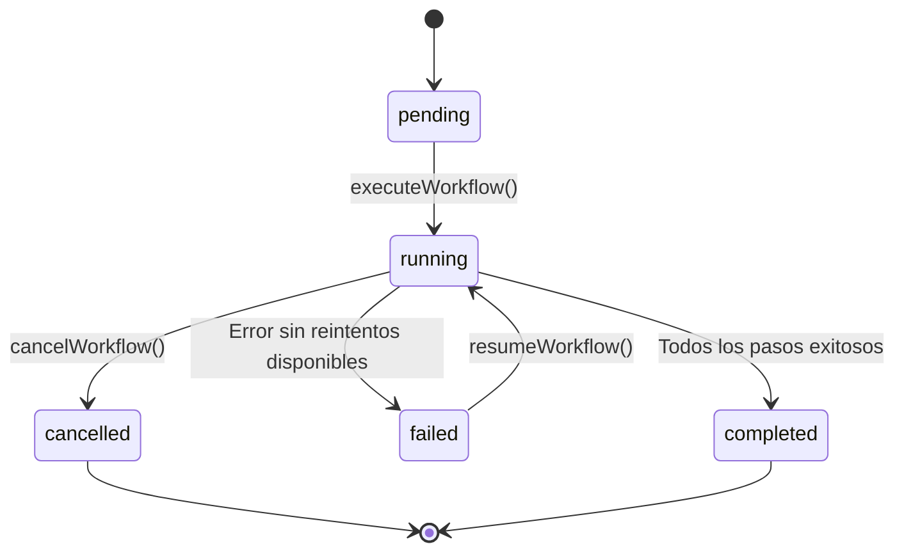

# Motor de Workflows Asíncronos y Resilientes (Fase 18)

## 1. Modelo de Definición de Workflows

Un workflow representa una tubería de producción DAG compuesta por pasos interdependientes:
- **`id` y `version`:** identificadores deterministas.
- **`dependsOn`:** dependencias entre pasos validadas mediante ordenamiento topológico (`WorkflowPlanner`).
- **`retryPolicy`:** política de reintentos (`maxAttempts`, `intervalMs`, `strategy`).
- **`idempotent`:** declaración explícita de seguridad ante reejecuciones.

## 2. Checkpoints Persistentes y Recuperación ante Caídas

1. **`CheckpointManager`:**
   Tras la finalización exitosa de cada paso, se guarda un snapshot inmutable del contexto:
   - `stepId` completado.
   - Lista de `completedSteps`.
   - `revisionId` resultante.
   - Variables de contexto serializadas.
   - Hash criptográfico del checkpoint.

2. **`WorkflowRecovery`:**
   Si el proceso se cae o se interrumpe, `resumeWorkflow` recupera el último checkpoint válido y continúa desde el siguiente paso pendiente sin repetir trabajo ya concluido.

## 3. Ciclo de Vida del Workflow (`WorkflowState`)

