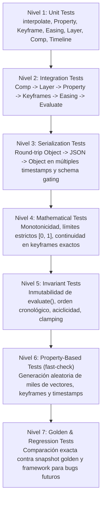

# Especificación Técnica: Fase 1.5 — Verification & Test Suite

**Documento:** `spec/phase-1.5-verification.md`  
**Estado:** VIGENTE / CONGELADO  
**Objetivo:** Establecer la barrera de verificación y suite de tests de 7 capas para blindar el Core Temporal antes de iniciar la Fase 2.

---

## 1. Las 7 Capas de Verificación

---

## 2. Definición de Capas y Contratos de Prueba

### Nivel 1 — Unit Tests
- `interpolate<T>` con `number`, `Vector2`, `Vector3`, `Color`.
- Verificación estricta de no-mutación de objetos de entrada (`from` y `to` intactos).
- `Property<T>`: valores estáticos, 1 keyframe, 2 keyframes, 3+ keyframes, inserción no ordenada, duplicados, borrado y clear.
- `Layer`: activación $[ \text{startTime}, \text{endTime} )$, evaluación y propiedades por defecto.
- `Composition`: dimensiones, stack de capas, `moveLayer`, `getLayer`.
- `Timeline`: conversiones bidireccionales con frames fraccionarios.

### Nivel 2 — Integration Tests
- Flujo completo de animación real con múltiples propiedades (`opacity`, `scale`, `position`, `rotation`) y easings diferenciados.
- Evaluación en instantes intermedios con cálculo analítico exacto.

### Nivel 3 — Serialization & Schema Tests
- Round-trip `Composition -> JSON (v0.1.0) -> Composition` evaluado en $t = [0, 0.1, 0.25, 0.5, 0.75, 1.0, 1.5, 2.0, 5.0]$.
- Validación de schema version gating (`schemaVersion === "0.1.0"` obligatorio).

### Nivel 4 — Mathematical Tests
- **Rango y Clamping:** Para easings estándar, $\forall t \in [0, 1], 0 \le E(t) \le 1$.
- **Límites Exactos:** $E(0) \equiv 0.0$ y $E(1) \equiv 1.0$ sin residuos de punto flotante.
- **Monotonicidad:** Para todo $t_1 \le t_2 \implies E(t_1) \le E(t_2)$.
- **Continuidad en Keyframes:** En $t = K_i.\text{time}$, `property.evaluate(t)` devuelve exactamente el valor almacenado en $K_i$.

### Nivel 5 — Invariant Tests
1. **Invariante de Inmutabilidad:** `composition.evaluate(t)` no muta el árbol del proyecto (`beforeJSON === afterJSON` tras 100 evaluaciones).
2. **Invariante de Orden:** Los keyframes siempre satisfacen $K_i.\text{time} < K_{i+1}.\text{time}$.
3. **Invariante de No Duplicación:** En un timestamp $t$ solo puede existir un keyframe.
4. **Invariante de Actividad:** Una capa fuera de $[ \text{startTime}, \text{endTime} )$ devuelve `active: false` y omite propiedades.

### Nivel 6 — Property-Based Tests (`fast-check`)
- Generación de miles de casos aleatorios con números extremos, negativos y flotantes:
  - $\forall a, b \in \mathbb{R}, \text{interpolate}(a, b, 0) \equiv a$
  - $\forall a, b \in \mathbb{R}, \text{interpolate}(a, b, 1) \equiv b$
  - $\forall a, b \in \mathbb{R}, \forall p < 0, \text{interpolate}(a, b, p) \equiv a$
  - $\forall a, b \in \mathbb{R}, \forall p > 1, \text{interpolate}(a, b, p) \equiv b$
  - Invariante de interpolación de vectores 2D y 3D en miles de combinaciones aleatorias.

### Nivel 7 — Golden Tests & Performance Baseline
- **Golden Snapshot:** Comparación bit a bit contra [`tests/golden/phase1-golden.snapshot.json`](file:///d:/Proyectos/TEST/after-effects-mcp/src/tests/golden/phase1-golden.snapshot.json) evaluado en 7 marcas temporales clave.
- **Performance Baseline:** Medición de tiempo de ejecución para un proyecto de **100 capas $\times$ 10 propiedades $\times$ 20 keyframes** evaluado en **1000 timestamps**.
