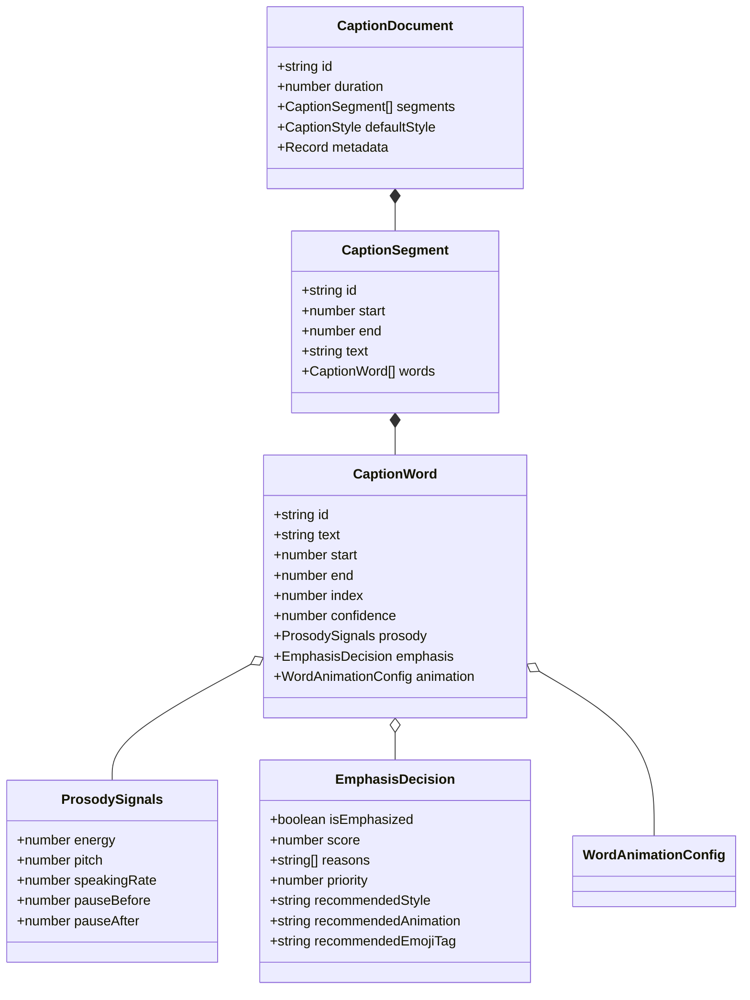

# Especificación Técnica: Fase 16 — Typography, Word Highlighting & Caption Intelligence

**Documento:** `spec/phase-16-typography-captions.md`  
**Estado:** VIGENTE / NORMATIVO  
**Versión de Esquema:** `v1.6.0`  
**Módulo Principal:** `src/captions/`

---

## 1. Propósito y Alcance

La **Fase 16** extiende el motor audiovisual determinista dotándolo de un subsistema completo de **inteligencia tipográfica y subtitulado cinético de alto impacto** para plataformas de video vertical y horizontal (TikTok, YouTube Shorts, Instagram Reels).

### 1.1. Principios Arquitectónicos e Invariantes
1. **Desacoplamiento de Renderizado:** El módulo de inteligencia tipográfica NO dibuja píxeles directamente. Produce **decisiones y estructuras declarativas (IR)** que el evaluador temporal y el renderizador existente consumen de forma pura:
   $$\text{EvaluatedCaptionState}(t) = \text{EvaluateCaption}(\text{CaptionDocument}, t)$$
2. **Determinismo Estricto:** Mismos inputs + misma configuración/seed = exactamente el mismo IR, mismos bounding boxes y misma evaluación numérica:
   $$\forall \text{input}, \quad \text{Evaluate}(\text{input}, t)_{\text{run 1}} \equiv \text{Evaluate}(\text{input}, t)_{\text{run 2}}$$
   Prohibido el uso de `Math.random()`, `Date.now()` o UUIDs aleatorios. Todo generador estocástico es un PRNG determinista con semilla fija.
3. **Robustez ante Prosodia Ausente:** Si el archivo de transcripción no contiene datos acústicos/prosódicos (ej. SRT básico o Whisper sin pitch), el motor aplica heurísticas léxicas deterministas sin degradar la estabilidad ni inventar precisión falsa.
4. **Idempotencia en Normalización:**
   $$\text{normalize}(\text{normalize}(\text{transcript})) \equiv \text{normalize}(\text{transcript})$$
5. **No Truncamiento Silencioso:** Si un layout no puede cumplirse dentro de las restricciones de ancho/líneas, se emite un diagnóstico estructurado y se aplica un fallback determinista seguro.

---

## 2. Modelo Canónico de Datos

### 2.1. Validaciones Temporales Invariantes
- $\forall s \in \text{segments}: \text{start}_s \ge 0 \land \text{end}_s > \text{start}_s \land \text{start}_s, \text{end}_s \in \mathbb{R}_{\text{finite}}$.
- $\forall w \in \text{words}: \text{start}_s \le \text{start}_w < \text{end}_w \le \text{end}_s$.
- Segmentos ordenados cronológicamente: $\text{start}_{s_i} \le \text{start}_{s_{i+1}}$.

---

## 3. Parsers y Normalización

### 3.1. SRT Parser
- Soporte para marcas de tiempo estándar `HH:MM:SS,mmm --> HH:MM:SS,mmm` y con punto `HH:MM:SS.mmm`.
- Manejo de saltos de línea CRLF/LF, BOM UTF-8 y espacios superfluos.
- Soporte de distribución temporal uniforme para subtítulos SRT que carecen de timestamps a nivel de palabra.
- Recuperación determinista ante cues vacíos o fuera de orden.

### 3.2. Whisper JSON Parser
- Ingesta de esquemas nativos Whisper y variantes (`segments` con `words`, timestamps `start`/`end` en segundos flotantes, `probability`/`confidence`).
- Manejo de fallback para segmentos sin array de `words`.

### 3.3. Caption Normalizer
- Separación limpia de tokens de puntuación preservando emojis y caracteres diacríticos (`Intl.Segmenter`).
- Generación determinista de identificadores (`seg_0`, `w_0_0`).
- Garantía de idempotencia: $\text{norm}(\text{norm}(x)) == \text{norm}(x)$.

---

## 4. Motor de Énfasis e Inteligencia Prosódica

### 4.1. Fórmula de Puntuación de Énfasis (Emphasis Scoring)
Para cada palabra $w_i$, el score de relevancia $S(w_i) \in [0, 1]$ se calcula de forma pura:

$$S(w_i) = \text{clamp}_{[0, 1]}\left( w_{\text{lex}} \cdot S_{\text{lex}}(w_i) + w_{\text{pos}} \cdot S_{\text{pos}}(w_i) + w_{\text{pros}} \cdot S_{\text{pros}}(w_i) \right)$$

Donde:
1. **Puntaje Léxico $S_{\text{lex}}$:**
   - Longitud de palabra ($\ge 6$ caracteres $\to +0.15$).
   - Mayúsculas sostenidas / ALL-CAPS ($\to +0.30$).
   - Puntuación enfática (`!`, `?` $\to +0.25$).
   - Filtro de Stopwords (palabras de enlace "de", "la", "el", "the", "and" reciben puntuación base $0.0$).
2. **Puntaje Posicional $S_{\text{pos}}$:**
   - Palabras en posición de enganche (inicio de frase) o remate (final de frase) reciben un bono de $+0.20$.
3. **Puntaje Prosódico $S_{\text{pros}}$ (si existe metadata acústica):**
   $$S_{\text{pros}} = 0.35 \cdot E_{\text{norm}} + 0.35 \cdot P_{\text{norm}} + 0.30 \cdot \text{clamp}_{[0, 1]}\left(\frac{\text{pauseAfter}}{0.5}\right)$$

---

## 5. Animaciones Cinéticas por Palabra (Word Animations)

Cuatro funciones matemáticas puras evaluables en tiempo continuo $t \in [t_{\text{start}}, t_{\text{end}}]$:

1. **PopScale:**
   $$\tau = \frac{t - t_{\text{start}}}{t_{\text{end}} - t_{\text{start}}}, \quad \text{scale}(\tau) = 1.0 + A_{\text{pop}} \cdot \sin(\pi \tau) \cdot e^{-3\tau}$$
2. **GlowPulse:**
   $$\text{glowIntensity}(\tau) = I_{\text{base}} + I_{\text{pulse}} \cdot \sin^2(\pi \tau)$$
3. **ColorHighlight:**
   $$\text{color}(t) = \begin{cases} C_{\text{inactive}} & \text{si } t < t_{\text{start}} \\ \text{lerp}(C_{\text{inactive}}, C_{\text{highlight}}, \text{easeOut}(\tau)) & \text{si } t \in [t_{\text{start}}, t_{\text{end}}] \\ C_{\text{completed}} & \text{si } t > t_{\text{end}} \end{cases}$$
4. **Shake:**
   Vibración pseudoaleatoria determinista calculada con PRNG LCG con semilla:
   $$\Delta x(t) = A_{\text{shake}} \cdot \text{PRNG}(\text{seed} + \lfloor 30t \rfloor), \quad \Delta y(t) = A_{\text{shake}} \cdot \text{PRNG}(\text{seed} + 1000 + \lfloor 30t \rfloor)$$

---

## 6. Layout Dinámico y Prevención de Huérfanas (Widow/Orphan Prevention)

- **Algoritmo de Envoltura Multilínea:**
  - Calcula la anchura acumulada $\sum (w.\text{width} + \text{tracking})$.
  - Si la última línea contiene exactamente 1 sola palabra corta (huérfana) y la línea anterior tiene espacio disponible, redistribuye la última palabra de la línea anterior hacia la última línea para lograr balance estético.
- **Backgrounds Adaptativos:**
  - **Pill Background:** Un único rectángulo redondeado con radio $r_{\text{clamped}} = \min(r, \frac{\min(w, h)}{2})$ envolviendo toda la línea.
  - **Split Boxes:** Cajas individuales por palabra activa o por grupo con separación horizontal `gap`.

---

## 7. Safe Zones para Plataformas Móviles

| Plataforma | Resolución | Inset Superior | Inset Inferior | Inset Derecho | Inset Izquierdo |
|---|---|---|---|---|---|
| **TikTok** | $1080 \times 1920$ | $150\text{px}$ | $350\text{px}$ | $140\text{px}$ | $40\text{px}$ |
| **Instagram Reels** | $1080 \times 1920$ | $160\text{px}$ | $280\text{px}$ | $120\text{px}$ | $40\text{px}$ |
| **YouTube Shorts** | $1080 \times 1920$ | $120\text{px}$ | $220\text{px}$ | $110\text{px}$ | $40\text{px}$ |

El `SafeZoneResolver` analiza los bounding boxes generados por el layout y corrige su coordenada vertical $Y$ según la prioridad: `bottom-center` $\to$ `center` $\to$ `top-center`.

---

## 8. Catálogo de Presets Virales

1. **`hormozi-impact`:**
   - Tipografía: Montserrat Black / Sans Bold, mayúsculas sostenidas, tamaño grande ($72\text{pt}$).
   - Énfasis: PopScale ($1.25\times$) + Color Highlight (Amarillo `#FFE500`), trazo negro grueso ($10\text{px}$).
   - Background: Split Boxes oscuras semi-transparentes.
2. **`beast-clean`:**
   - Tipografía: Futura Bold / Inter Bold, tamaño mediano ($64\text{pt}$).
   - Énfasis: PopScale ($1.15\times$) + Sombra proyectada profunda, texto blanco nítido.
   - Background: Sin fondo o Pill Background sutil.
3. **`vox-minimal`:**
   - Tipografía: Humanist Sans / Serif elegante ($52\text{pt}$).
   - Énfasis: Resaltado sutil en caja pastel y fade suave.
   - Background: Caja completa rectangular suave.
4. **`karaoke-gradient`:**
   - Tipografía: Poppins ExtraBold ($68\text{pt}$).
   - Énfasis: Barrido continuo de gradiente multicolor (Cian $\to$ Magenta) con GlowPulse.
5. **`neon-glow`:**
   - Tipografía: Cyberpunk Display ($70\text{pt}$).
   - Énfasis: GlowPulse multicapa intenso + Shake en palabras clave con emojis neón.

---

## 9. Suite de Pruebas de 7 Capas Obligatoria

1. **Unit Tests:** Parsers (SRT, Whisper), Normalizer, Intelligence Rules, Animations (PopScale, Glow, Highlight, Shake), Layout & Widow Prevention, Backgrounds, Safe Zones, Emoji Matching.
2. **Integration Tests:** Pipeline completo `SRT -> Normalizer -> Intelligence -> Layout -> SafeZone -> Presets -> IR -> Evaluate(t)`.
3. **Serialization Tests:** Round-trip `CaptionDocument -> JSON (v1.6.0) -> CaptionDocument`.
4. **Mathematical Tests:** Monotonicidad, límites exactos, clamping, continuidad de funciones de animación en $t < t_0$, $t = t_0$, $t_{\text{mid}}$, $t = t_1$, $t > t_1$.
5. **Invariant Tests:** Inmutabilidad de `Evaluate()`, determinismo estricto, no NaN/Infinity, no mutación de presets base.
6. **Property-Based Tests (`fast-check`):** Fuzzing con cadenas Unicode, emojis complejos, timestamps aleatorios extremos y frases gigantescas.
7. **Benchmarks:** Mediciones de latencia para 10, 100, 1,000 y 10,000 palabras ($< 15\text{ms}$ para 1,000 palabras).
