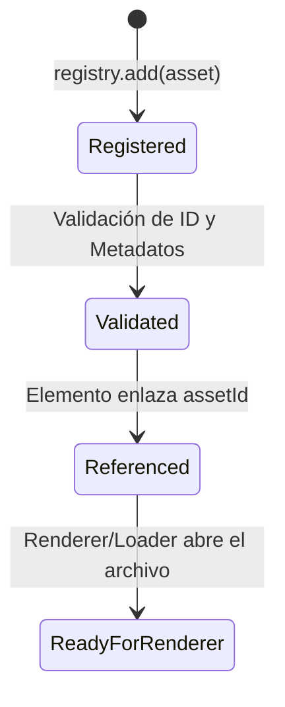

# Especificación Técnica: Fase 2A — Transform System + Asset System

**Documento:** `spec/phase-2a-transform-and-assets.md`  
**Estado:** VIGENTE / CONGELADO  
**Módulos:** `src/math/`, `src/elements/transform.ts`, `src/assets/`

---

## 1. Módulo 2A.1: Sistema de Transformación Espacial (Transform System)

### 1.1. Sistema de Coordenadas y Convenciones
- **Espacio de Composición:**
  - Origen $(0, 0)$ en la esquina superior izquierda (top-left).
  - Eje $+X$ hacia la derecha.
  - Eje $+Y$ hacia abajo.
- **Ángulos de Rotación:**
  - Expresados en **grados sexagesimales** ($\theta^\circ$).
  - Sentido horario (clockwise) positivo, alineado con After Effects, SVG y Canvas 2D.
- **Escala:**
  - Factores multiplicativos $s_x, s_y$ donde $1.0 = 100\%$, $0.5 = 50\%$, $2.0 = 200\%$.
- **Opacidad:**
  - Escalar normalizado en $[0.0, 1.0]$.
  - En jerarquías: $\text{Opacity}_{\text{world}} = \prod \text{Opacity}_{\text{ancestors}} \times \text{Opacity}_{\text{local}}$.

### 1.2. Anchor Point (Punto de Anclaje) y Pivot
El `anchorPoint` se define de forma normalizada $(a_x, a_y) \in [0.0, 1.0]$:
- $(0.0, 0.0) \implies$ Esquina superior izquierda del elemento.
- $(0.5, 0.5) \implies$ Centro geométrico del elemento (valor por defecto).
- $(1.0, 1.0) \implies$ Esquina inferior derecha.

Cuando se conocen las dimensiones $(w, h)$ del elemento, el desplazamiento de pivot es:
$$P_{\text{pivot}} = (a_x \cdot w, a_y \cdot h)$$

### 1.3. Composición de Matrices Afines 2D (Local Matrix)
Toda transformación 2D se representa como una matriz afín $3 \times 3$ homogénea:
$$M = \begin{pmatrix} a & c & tx \\ b & d & ty \\ 0 & 0 & 1 \end{pmatrix}$$

El orden estricto de composición sobre el elemento es:
$$M_{\text{local}} = T(p_x, p_y) \cdot R(\theta) \cdot S(s_x, s_y) \cdot T(-a_x \cdot w, -a_y \cdot h)$$

Donde:
1. $T(-P_{\text{pivot}})$ traslada el origen al punto de anclaje.
2. $S(s_x, s_y)$ aplica la escala.
3. $R(\theta)$ aplica la rotación horaria.
4. $T(p_x, p_y)$ posiciona el elemento en las coordenadas finales.

### 1.4. Jerarquía Espacial y Matriz Mundial (World Matrix)
Para cualquier elemento hijo de un contenedor o grupo:
$$M_{\text{world}} = M_{\text{parent\_world}} \times M_{\text{local}}$$

Proyección de puntos entre espacios:
- **Local a Mundial:** $P_{\text{world}} = M_{\text{world}} \times P_{\text{local}}$
- **Mundial a Local:** $P_{\text{local}} = M_{\text{world}}^{-1} \times P_{\text{world}}$

---

## 2. Módulo 2A.2: Sistema de Recursos (Asset System)

### 2.1. Desacoplamiento Absoluto del Core
> **Invariante:** El Core jamás abre archivos en disco, no realiza llamadas a red ni invoca decodificadores de medios. Maneja únicamente descripciones de activos y metadatos estructurados.

### 2.2. Tipos de Activos y Esquemas de Metadatos

```typescript
export type AssetType = "image" | "video" | "audio";

export interface ImageAssetMetadata {
  width: number;
  height: number;
  aspectRatio?: number;
  colorSpace?: string;
  format?: string;
}

export interface VideoAssetMetadata {
  width: number;
  height: number;
  duration: number; // en segundos
  fps: number;
  codec?: string;
  hasAudio?: boolean;
  aspectRatio?: number;
}

export interface AudioAssetMetadata {
  duration: number; // en segundos
  sampleRate: number; // ej. 44100, 48000
  channels: number; // 1 = mono, 2 = stereo
  bitrate?: number;
}
```

### 2.3. Esquemas de URI Soportados
Los activos pueden referenciar rutas mediante:
- `file://...` (archivos locales en disco)
- `asset://...` (recursos embebidos en el paquete/bundle)
- `https://...` (recursos remotos en la nube o CDN)
- `mcp://...` (recursos suministrados por herramientas MCP)

### 2.4. Ciclo de Vida del Asset (`AssetRegistry`)


Operaciones de `AssetRegistry`:
- `add(asset: AssetReference): void` (Rechaza IDs duplicados o datos inválidos)
- `get(id: string): AssetReference | undefined`
- `getByType(type: AssetType): AssetReference[]`
- `remove(id: string): boolean`
- `has(id: string): boolean`
- `list(): AssetReference[]`
